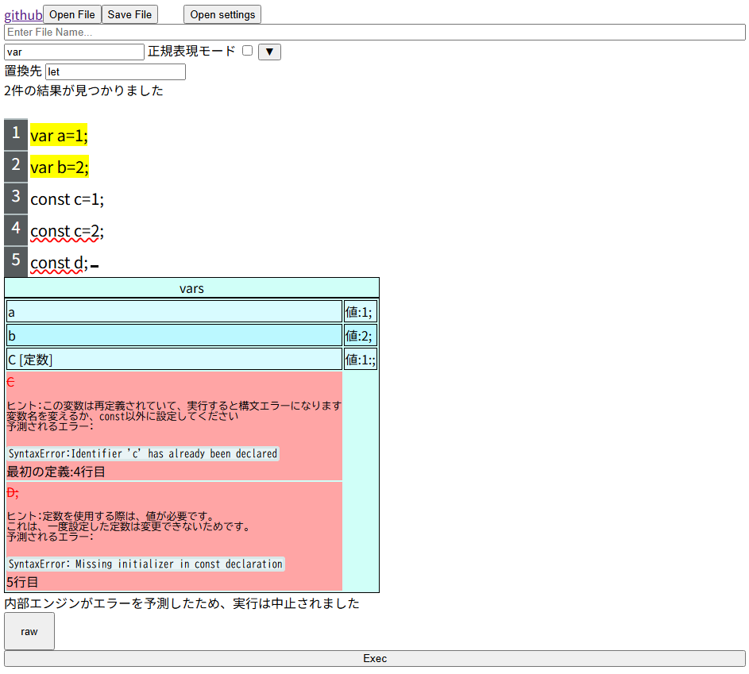

# [FIDE - Fjalu/Fjala Engine build-in simple IDE made in japan](https://f69-js.github.io/FIDE-F69s-IDE/)

---
## Features
- Text Editor
-  Available text input and clipboard
- File Loading and Saving
- You can load files, edit them, and save them.
- Romazi Converter
- Pressing `ctrl+J` will translate that line into Japanese.
- Easter Egg
- Doing something at the location of the file name will reveal hidden elements???
---
## How to Use
### Text Entering
Click on the cursor area of ​​the window before typing.
if want to delete characters, press the `←` (Backspace) key.
### Paste
Press `ctrl+v` to paste.
### Convert to Romaji Characters
Press `ctrl+J` if you translate the Romaji
### Executing Code
Enter the code and press the `Exec` button below.
### Checking Variable Names
Check the  a light blue table named `vars`.
### Loading a File(only one)
Press the **Open File** button in the upper left and select the file in Selection Prompt.
### Save as File
Press the **Save File** button (second from the top left), set the file name in File Save Prompt, and then save.
### Change the File Name
Enter the name in the input field.
It will also appear in the Main Area, so please delete it.
### Opening Settings
Press **Open Settings** in the upper right. You can select a theme from here, and the theme will be retained for your next access.
## QA
Q: Why are the Tab characters vertical bars?
> A: This is to make the indentation (depth) easier to understand in programming. Don't worry, they will remain as Tabs during downloads, etc.

Q: There are variables in the vars table that are crossed out and highlighted in red. What should I do?
> A: There is an error in the part with the red wavy underline. Please correct it according to the instructions.
Also, clicking on the line number (e.g., `line 2`) will show the location of the code.

Q: I got the message "Execution was aborted because the internal engine predicted an error"

> A: The editor detected an error before execution, for safety reasons, code was not executed.
Please fix all errors according to the instructions.
Q:I found bug. What should I do?

> A: Please report it.
---
# [FIDE](https://f69-js.github.io/FIDE-F69s-IDE/) was created by F69 using [Gemini](https://gemini.google.com/)
